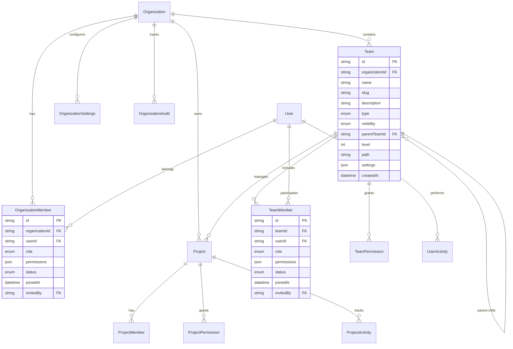

# 📊 數據結構設計

## 📋 概述

本文檔詳細描述了 GitHub 組織功能系統的完整數據結構設計，包括實體關係、數據模型、索引策略和數據庫設計原則。

## 🏗️ 數據架構概覽

### 核心實體關係圖


## 📋 核心實體定義

### 1. 組織實體 (Organization)
```typescript
interface Organization {
  // 基本信息
  id: string;                    // 組織唯一標識 (UUID)
  name: string;                  // 組織名稱
  slug: string;                  // URL 友好的組織標識 (唯一)
  description?: string;          // 組織描述
  avatar?: string;               // 組織頭像 URL
  website?: string;              // 組織網站
  
  // 組織類型與可見性
  type: OrganizationType;        // 組織類型
  visibility: OrganizationVisibility; // 組織可見性
  
  // 層級結構
  parentOrganizationId?: string; // 父組織 ID (支持組織層級)
  level: number;                 // 組織層級
  path: string;                  // 組織路徑 (如: /parent/child)
  
  // 設置與配置
  settings: OrganizationSettings; // 組織設置
  billing: OrganizationBilling;  // 計費信息
  compliance: ComplianceSettings; // 合規設置
  
  // 統計數據
  statistics: OrganizationStats; // 統計數據
  
  // 時間戳
  createdAt: Date;              // 創建時間
  updatedAt: Date;              // 更新時間
  createdBy: string;            // 創建者 ID
  
  // 軟刪除
  deletedAt?: Date;             // 刪除時間
  deletedBy?: string;           // 刪除者 ID
}

enum OrganizationType {
  PERSONAL = 'personal',         // 個人組織
  ENTERPRISE = 'enterprise',     // 企業組織
  OPEN_SOURCE = 'open_source',   // 開源組織
  EDUCATIONAL = 'educational',   // 教育組織
  NON_PROFIT = 'non_profit'      // 非營利組織
}

enum OrganizationVisibility {
  PUBLIC = 'public',            // 公開組織
  PRIVATE = 'private',          // 私有組織
  RESTRICTED = 'restricted'     // 受限組織
}
```

### 2. 組織設置 (OrganizationSettings)
```typescript
interface OrganizationSettings {
  // 基本設置
  defaultPermissions: Permission[]; // 默認權限設置
  policies: OrganizationPolicies;   // 組織政策
  notifications: NotificationSettings; // 通知設置
  
  // 安全設置
  security: SecuritySettings;       // 安全設置
  dataRetention: DataRetentionPolicy; // 數據保留策略
  
  // 集成設置
  integrations: IntegrationSettings; // 集成設置
  apiSettings: ApiSettings;         // API 設置
  
  // 品牌設置
  branding: BrandingSettings;       // 品牌設置
  theme: ThemeSettings;            // 主題設置
  
  // 功能開關
  features: FeatureFlags;          // 功能開關
}

interface OrganizationPolicies {
  memberInvitationPolicy: MemberInvitationPolicy; // 成員邀請政策
  repositoryCreationPolicy: RepositoryCreationPolicy; // 倉庫創建政策
  teamCreationPolicy: TeamCreationPolicy; // 團隊創建政策
  apiAccessPolicy: ApiAccessPolicy; // API 訪問政策
  dataProcessingPolicy: DataProcessingPolicy; // 數據處理政策
}

interface SecuritySettings {
  twoFactorRequired: boolean;      // 強制雙因子認證
  passwordPolicy: PasswordPolicy;  // 密碼策略
  sessionTimeout: number;          // 會話超時 (分鐘)
  ipWhitelist: string[];          // IP 白名單
  loginNotifications: boolean;     // 登錄通知
  suspiciousActivityAlerts: boolean; // 可疑活動警報
}

interface DataRetentionPolicy {
  auditLogRetention: number;       // 審計日誌保留天數
  userDataRetention: number;       // 用戶數據保留天數
  projectDataRetention: number;    // 項目數據保留天數
  activityLogRetention: number;    // 活動日誌保留天數
  autoDeleteEnabled: boolean;      // 自動刪除啟用
  archiveBeforeDelete: boolean;    // 刪除前歸檔
}
```

### 3. 組織成員 (OrganizationMember)
```typescript
interface OrganizationMember {
  // 基本信息
  id: string;                   // 成員關係 ID
  organizationId: string;       // 組織 ID
  userId: string;               // 用戶 ID
  
  // 角色與權限
  role: OrganizationRole;       // 組織角色
  permissions: Permission[];    // 具體權限列表
  customPermissions: CustomPermission[]; // 自定義權限
  
  // 狀態管理
  status: MemberStatus;         // 成員狀態
  invitationId?: string;        // 邀請 ID
  
  // 時間戳
  joinedAt: Date;              // 加入時間
  invitedBy: string;           // 邀請者 ID
  lastActiveAt: Date;          // 最後活躍時間
  
  // 設置與偏好
  settings: MemberSettings;    // 成員設置
  preferences: MemberPreferences; // 成員偏好
  
  // 審計信息
  roleChangedAt?: Date;        // 角色變更時間
  roleChangedBy?: string;      // 角色變更者
  statusChangedAt?: Date;      // 狀態變更時間
  statusChangedBy?: string;    // 狀態變更者
}

enum OrganizationRole {
  OWNER = 'owner',             // 所有者
  ADMIN = 'admin',             // 管理員
  MEMBER = 'member',           // 成員
  OUTSIDE_COLLABORATOR = 'outside_collaborator', // 外部協作者
  GUEST = 'guest'              // 訪客
}

enum MemberStatus {
  ACTIVE = 'active',           // 活躍
  PENDING = 'pending',         // 待審核
  SUSPENDED = 'suspended',     // 暫停
  BLOCKED = 'blocked',         // 封鎖
  INACTIVE = 'inactive'        // 非活躍
}
```

### 4. 團隊實體 (Team)
```typescript
interface Team {
  // 基本信息
  id: string;                    // 團隊唯一標識
  organizationId: string;        // 組織 ID
  name: string;                  // 團隊名稱
  slug: string;                  // URL 友好的團隊標識
  description?: string;          // 團隊描述
  avatar?: string;               // 團隊頭像
  
  // 類型與可見性
  type: TeamType;                // 團隊類型
  visibility: TeamVisibility;    // 團隊可見性
  
  // 層級結構
  parentTeamId?: string;         // 父團隊 ID
  level: number;                 // 團隊層級
  path: string;                  // 團隊路徑
  children: string[];            // 子團隊 ID 列表
  
  // 設置與配置
  settings: TeamSettings;        // 團隊設置
  permissions: TeamPermission[]; // 團隊權限
  members: TeamMember[];         // 團隊成員
  
  // 統計數據
  statistics: TeamStatistics;    // 團隊統計
  
  // 時間戳
  createdAt: Date;              // 創建時間
  updatedAt: Date;              // 更新時間
  createdBy: string;            // 創建者 ID
  
  // 軟刪除
  deletedAt?: Date;             // 刪除時間
  deletedBy?: string;           // 刪除者 ID
}

enum TeamType {
  DEPARTMENT = 'department',     // 部門
  PROJECT = 'project',          // 項目團隊
  FUNCTIONAL = 'functional',    // 職能團隊
  MATRIX = 'matrix',            // 矩陣團隊
  VIRTUAL = 'virtual',          // 虛擬團隊
  CROSS_FUNCTIONAL = 'cross_functional' // 跨職能團隊
}

interface TeamSettings {
  allowSelfJoin: boolean;        // 允許自主加入
  requireApproval: boolean;      // 需要審核
  maxMembers: number;           // 最大成員數
  defaultRole: TeamRole;        // 默認角色
  notificationSettings: TeamNotificationSettings; // 通知設置
  collaborationSettings: CollaborationSettings; // 協作設置
  workflowSettings: WorkflowSettings; // 工作流設置
}
```

### 5. 項目實體 (Project)
```typescript
interface Project {
  // 基本信息
  id: string;                    // 項目唯一標識
  organizationId: string;        // 組織 ID
  name: string;                  // 項目名稱
  slug: string;                  // URL 友好的項目標識
  description?: string;          // 項目描述
  avatar?: string;               // 項目頭像
  
  // 項目類型與狀態
  type: ProjectType;             // 項目類型
  status: ProjectStatus;         // 項目狀態
  priority: ProjectPriority;     // 項目優先級
  visibility: ProjectVisibility; // 項目可見性
  
  // 歸屬關係
  ownerTeamId?: string;          // 負責團隊 ID
  ownerUserId?: string;          // 負責用戶 ID
  parentProjectId?: string;      // 父項目 ID
  
  // 項目配置
  settings: ProjectSettings;     // 項目設置
  permissions: ProjectPermission[]; // 項目權限
  members: ProjectMember[];      // 項目成員
  
  // 時間管理
  startDate?: Date;              // 開始日期
  endDate?: Date;                // 結束日期
  deadline?: Date;               // 截止日期
  
  // 統計數據
  statistics: ProjectStatistics; // 項目統計
  
  // 時間戳
  createdAt: Date;              // 創建時間
  updatedAt: Date;              // 更新時間
  createdBy: string;            // 創建者 ID
}

enum ProjectType {
  SOFTWARE = 'software',         // 軟件項目
  RESEARCH = 'research',         // 研究項目
  MARKETING = 'marketing',       // 營銷項目
  OPERATIONS = 'operations',     // 運營項目
  INFRASTRUCTURE = 'infrastructure' // 基礎設施項目
}

enum ProjectStatus {
  PLANNING = 'planning',         // 規劃中
  ACTIVE = 'active',            // 進行中
  ON_HOLD = 'on_hold',          // 暫停
  COMPLETED = 'completed',       // 已完成
  CANCELLED = 'cancelled'        // 已取消
}
```

## 🔐 權限系統設計

### 權限模型架構
```typescript
// 基礎權限定義
enum Permission {
  // 組織級權限
  ORG_MANAGE = 'org_manage',
  ORG_VIEW = 'org_view',
  ORG_DELETE = 'org_delete',
  
  // 成員管理權限
  MEMBER_INVITE = 'member_invite',
  MEMBER_REMOVE = 'member_remove',
  MEMBER_MANAGE_ROLES = 'member_manage_roles',
  
  // 團隊管理權限
  TEAM_CREATE = 'team_create',
  TEAM_MANAGE = 'team_manage',
  TEAM_DELETE = 'team_delete',
  
  // 項目管理權限
  PROJECT_CREATE = 'project_create',
  PROJECT_MANAGE = 'project_manage',
  PROJECT_DELETE = 'project_delete',
  
  // 設置管理權限
  SETTINGS_MANAGE = 'settings_manage',
  SETTINGS_VIEW = 'settings_view',
  
  // 審計權限
  AUDIT_VIEW = 'audit_view',
  AUDIT_EXPORT = 'audit_export'
}

// 資源類型定義
enum ResourceType {
  ORGANIZATION = 'organization',
  TEAM = 'team',
  PROJECT = 'project',
  REPOSITORY = 'repository',
  DOCUMENT = 'document',
  MEETING = 'meeting',
  TASK = 'task',
  USER = 'user'
}

// 權限實體
interface Permission {
  id: string;                    // 權限 ID
  name: string;                  // 權限名稱
  description: string;           // 權限描述
  resourceType: ResourceType;    // 資源類型
  action: PermissionAction;      // 操作類型
  conditions: PermissionCondition[]; // 權限條件
  isInheritable: boolean;        // 是否可繼承
  parentPermissionId?: string;   // 父權限 ID
}

enum PermissionAction {
  CREATE = 'create',             // 創建
  READ = 'read',                 // 讀取
  UPDATE = 'update',             // 更新
  DELETE = 'delete',             // 刪除
  MANAGE = 'manage',             // 管理
  INVITE = 'invite',             // 邀請
  EXPORT = 'export'              // 導出
}

interface PermissionCondition {
  type: ConditionType;           // 條件類型
  field: string;                 // 字段名
  operator: Operator;            // 操作符
  value: any;                    // 條件值
  description: string;           // 條件描述
}
```

### 角色權限映射
```typescript
// 組織角色權限映射
const ORGANIZATION_ROLE_PERMISSIONS: Record<OrganizationRole, Permission[]> = {
  [OrganizationRole.OWNER]: [
    Permission.ORG_MANAGE,
    Permission.ORG_DELETE,
    Permission.MEMBER_INVITE,
    Permission.MEMBER_REMOVE,
    Permission.MEMBER_MANAGE_ROLES,
    Permission.TEAM_CREATE,
    Permission.TEAM_MANAGE,
    Permission.TEAM_DELETE,
    Permission.PROJECT_CREATE,
    Permission.PROJECT_MANAGE,
    Permission.PROJECT_DELETE,
    Permission.SETTINGS_MANAGE,
    Permission.AUDIT_VIEW,
    Permission.AUDIT_EXPORT
  ],
  [OrganizationRole.ADMIN]: [
    Permission.ORG_VIEW,
    Permission.MEMBER_INVITE,
    Permission.MEMBER_REMOVE,
    Permission.MEMBER_MANAGE_ROLES,
    Permission.TEAM_CREATE,
    Permission.TEAM_MANAGE,
    Permission.PROJECT_CREATE,
    Permission.PROJECT_MANAGE,
    Permission.SETTINGS_MANAGE,
    Permission.AUDIT_VIEW
  ],
  [OrganizationRole.MEMBER]: [
    Permission.ORG_VIEW,
    Permission.TEAM_CREATE,
    Permission.PROJECT_CREATE
  ],
  [OrganizationRole.OUTSIDE_COLLABORATOR]: [
    Permission.ORG_VIEW
  ],
  [OrganizationRole.GUEST]: [
    Permission.ORG_VIEW
  ]
};

// 團隊角色權限映射
const TEAM_ROLE_PERMISSIONS: Record<TeamRole, Permission[]> = {
  [TeamRole.LEAD]: [
    Permission.TEAM_MANAGE,
    Permission.MEMBER_INVITE,
    Permission.MEMBER_REMOVE,
    Permission.PROJECT_CREATE,
    Permission.PROJECT_MANAGE
  ],
  [TeamRole.MANAGER]: [
    Permission.TEAM_VIEW,
    Permission.MEMBER_INVITE,
    Permission.PROJECT_CREATE,
    Permission.PROJECT_MANAGE
  ],
  [TeamRole.SENIOR]: [
    Permission.TEAM_VIEW,
    Permission.MEMBER_INVITE,
    Permission.PROJECT_CREATE
  ],
  [TeamRole.MEMBER]: [
    Permission.TEAM_VIEW,
    Permission.PROJECT_VIEW
  ],
  [TeamRole.CONTRIBUTOR]: [
    Permission.TEAM_VIEW
  ],
  [TeamRole.OBSERVER]: [
    Permission.TEAM_VIEW
  ]
};
```

## 📊 統計數據結構

### 組織統計 (OrganizationStats)
```typescript
interface OrganizationStats {
  // 成員統計
  memberCount: number;          // 成員總數
  activeMemberCount: number;    // 活躍成員數
  pendingMemberCount: number;   // 待審核成員數
  suspendedMemberCount: number; // 暫停成員數
  
  // 團隊統計
  teamCount: number;            // 團隊總數
  activeTeamCount: number;      // 活躍團隊數
  maxTeamDepth: number;         // 最大團隊層級
  
  // 項目統計
  projectCount: number;         // 項目總數
  activeProjectCount: number;   // 活躍項目數
  completedProjectCount: number; // 已完成項目數
  
  // 資源使用統計
  storageUsed: number;          // 已使用存儲空間 (bytes)
  bandwidthUsed: number;        // 已使用帶寬 (bytes)
  apiCallsUsed: number;         // 已使用 API 調用數
  
  // 活動統計
  lastActivityAt: Date;         // 最後活動時間
  dailyActiveUsers: number;     // 日活躍用戶數
  weeklyActiveUsers: number;    // 週活躍用戶數
  monthlyActiveUsers: number;   // 月活躍用戶數
  
  // 時間序列數據
  activityHistory: ActivityHistory[]; // 活動歷史
  usageHistory: UsageHistory[];       // 使用歷史
}

interface ActivityHistory {
  date: string;                 // 日期 (YYYY-MM-DD)
  activeUsers: number;          // 活躍用戶數
  loginCount: number;           // 登錄次數
  actionCount: number;          // 操作次數
  newMembers: number;           // 新成員數
  newProjects: number;          // 新項目數
}

interface UsageHistory {
  date: string;                 // 日期 (YYYY-MM-DD)
  storageUsed: number;          // 存儲使用量
  bandwidthUsed: number;        // 帶寬使用量
  apiCalls: number;             // API 調用數
  activeUsers: number;          // 活躍用戶數
}
```

### 團隊統計 (TeamStatistics)
```typescript
interface TeamStatistics {
  // 成員統計
  memberCount: number;          // 成員總數
  activeMemberCount: number;    // 活躍成員數
  roleDistribution: Record<TeamRole, number>; // 角色分佈
  
  // 項目統計
  projectCount: number;         // 項目總數
  activeProjectCount: number;   // 活躍項目數
  completedProjectCount: number; // 已完成項目數
  
  // 活動統計
  lastActivityAt: Date;         // 最後活動時間
  averageResponseTime: number;  // 平均響應時間 (小時)
  collaborationScore: number;   // 協作評分 (0-100)
  
  // 效率指標
  taskCompletionRate: number;   // 任務完成率
  meetingEfficiency: number;    // 會議效率
  codeQualityScore: number;     // 代碼質量評分
  
  // 時間序列數據
  activityTrend: ActivityTrend[]; // 活動趨勢
  performanceMetrics: PerformanceMetric[]; // 性能指標
}

interface ActivityTrend {
  period: string;               // 時間週期
  activityLevel: number;        // 活動水平
  productivityScore: number;    // 生產力評分
  collaborationIndex: number;   // 協作指數
}

interface PerformanceMetric {
  metric: string;               // 指標名稱
  value: number;                // 指標值
  unit: string;                 // 單位
  trend: 'up' | 'down' | 'stable'; // 趨勢
  target?: number;              // 目標值
}
```

## 🔍 審計日誌結構

### 審計日誌 (AuditLog)
```typescript
interface AuditLog {
  id: string;                   // 日誌 ID
  organizationId: string;       // 組織 ID
  userId: string;               // 用戶 ID
  userName: string;             // 用戶名稱
  
  // 操作信息
  action: AuditAction;          // 操作類型
  resourceType: ResourceType;   // 資源類型
  resourceId: string;           // 資源 ID
  resourceName: string;         // 資源名稱
  
  // 操作詳情
  description: string;          // 操作描述
  details: Record<string, any>; // 操作詳情
  metadata: AuditMetadata;      // 元數據
  
  // 結果信息
  result: AuditResult;          // 操作結果
  errorMessage?: string;        // 錯誤信息
  
  // 環境信息
  ipAddress: string;            // IP 地址
  userAgent: string;            // 用戶代理
  location?: GeolocationData;   // 地理位置
  deviceInfo?: DeviceInfo;      // 設備信息
  
  // 時間戳
  timestamp: Date;              // 操作時間
  duration?: number;            // 操作持續時間 (毫秒)
}

enum AuditAction {
  CREATE = 'create',            // 創建
  READ = 'read',                // 讀取
  UPDATE = 'update',            // 更新
  DELETE = 'delete',            // 刪除
  LOGIN = 'login',              // 登錄
  LOGOUT = 'logout',            // 登出
  INVITE = 'invite',            // 邀請
  REMOVE = 'remove',            // 移除
  GRANT_PERMISSION = 'grant_permission', // 授予權限
  REVOKE_PERMISSION = 'revoke_permission', // 撤銷權限
  EXPORT = 'export',            // 導出
  IMPORT = 'import'             // 導入
}

enum AuditResult {
  SUCCESS = 'success',          // 成功
  FAILURE = 'failure',          // 失敗
  PARTIAL = 'partial'           // 部分成功
}

interface AuditMetadata {
  sessionId: string;            // 會話 ID
  requestId: string;            // 請求 ID
  correlationId: string;        // 關聯 ID
  apiVersion: string;           // API 版本
  clientVersion: string;        // 客戶端版本
  additionalData: Record<string, any>; // 額外數據
}

interface DeviceInfo {
  type: 'desktop' | 'mobile' | 'tablet'; // 設備類型
  os: string;                   // 操作系統
  browser: string;              // 瀏覽器
  version: string;              // 版本
  fingerprint: string;          // 設備指紋
}
```

## 🗄️ 數據庫設計

### 表結構設計
```sql
-- 組織表
CREATE TABLE organizations (
    id UUID PRIMARY KEY DEFAULT gen_random_uuid(),
    name VARCHAR(255) NOT NULL,
    slug VARCHAR(255) UNIQUE NOT NULL,
    description TEXT,
    avatar VARCHAR(500),
    website VARCHAR(500),
    type VARCHAR(50) NOT NULL,
    visibility VARCHAR(50) NOT NULL,
    parent_organization_id UUID REFERENCES organizations(id),
    level INTEGER NOT NULL DEFAULT 0,
    path VARCHAR(1000) NOT NULL,
    settings JSONB NOT NULL DEFAULT '{}',
    billing JSONB NOT NULL DEFAULT '{}',
    compliance JSONB NOT NULL DEFAULT '{}',
    statistics JSONB NOT NULL DEFAULT '{}',
    created_at TIMESTAMP WITH TIME ZONE NOT NULL DEFAULT NOW(),
    updated_at TIMESTAMP WITH TIME ZONE NOT NULL DEFAULT NOW(),
    created_by UUID NOT NULL,
    deleted_at TIMESTAMP WITH TIME ZONE,
    deleted_by UUID
);

-- 組織成員表
CREATE TABLE organization_members (
    id UUID PRIMARY KEY DEFAULT gen_random_uuid(),
    organization_id UUID NOT NULL REFERENCES organizations(id) ON DELETE CASCADE,
    user_id UUID NOT NULL,
    role VARCHAR(50) NOT NULL,
    permissions JSONB NOT NULL DEFAULT '[]',
    custom_permissions JSONB NOT NULL DEFAULT '[]',
    status VARCHAR(50) NOT NULL DEFAULT 'active',
    invitation_id UUID,
    joined_at TIMESTAMP WITH TIME ZONE NOT NULL DEFAULT NOW(),
    invited_by UUID NOT NULL,
    last_active_at TIMESTAMP WITH TIME ZONE,
    settings JSONB NOT NULL DEFAULT '{}',
    preferences JSONB NOT NULL DEFAULT '{}',
    role_changed_at TIMESTAMP WITH TIME ZONE,
    role_changed_by UUID,
    status_changed_at TIMESTAMP WITH TIME ZONE,
    status_changed_by UUID,
    UNIQUE(organization_id, user_id)
);

-- 團隊表
CREATE TABLE teams (
    id UUID PRIMARY KEY DEFAULT gen_random_uuid(),
    organization_id UUID NOT NULL REFERENCES organizations(id) ON DELETE CASCADE,
    name VARCHAR(255) NOT NULL,
    slug VARCHAR(255) NOT NULL,
    description TEXT,
    avatar VARCHAR(500),
    type VARCHAR(50) NOT NULL,
    visibility VARCHAR(50) NOT NULL,
    parent_team_id UUID REFERENCES teams(id),
    level INTEGER NOT NULL DEFAULT 0,
    path VARCHAR(1000) NOT NULL,
    children UUID[] NOT NULL DEFAULT '{}',
    settings JSONB NOT NULL DEFAULT '{}',
    permissions JSONB NOT NULL DEFAULT '[]',
    statistics JSONB NOT NULL DEFAULT '{}',
    created_at TIMESTAMP WITH TIME ZONE NOT NULL DEFAULT NOW(),
    updated_at TIMESTAMP WITH TIME ZONE NOT NULL DEFAULT NOW(),
    created_by UUID NOT NULL,
    deleted_at TIMESTAMP WITH TIME ZONE,
    deleted_by UUID,
    UNIQUE(organization_id, slug)
);

-- 團隊成員表
CREATE TABLE team_members (
    id UUID PRIMARY KEY DEFAULT gen_random_uuid(),
    team_id UUID NOT NULL REFERENCES teams(id) ON DELETE CASCADE,
    user_id UUID NOT NULL,
    role VARCHAR(50) NOT NULL,
    permissions JSONB NOT NULL DEFAULT '[]',
    status VARCHAR(50) NOT NULL DEFAULT 'active',
    joined_at TIMESTAMP WITH TIME ZONE NOT NULL DEFAULT NOW(),
    invited_by UUID NOT NULL,
    last_active_at TIMESTAMP WITH TIME ZONE,
    responsibilities TEXT[],
    skills TEXT[],
    availability JSONB NOT NULL DEFAULT '{}',
    UNIQUE(team_id, user_id)
);

-- 項目表
CREATE TABLE projects (
    id UUID PRIMARY KEY DEFAULT gen_random_uuid(),
    organization_id UUID NOT NULL REFERENCES organizations(id) ON DELETE CASCADE,
    name VARCHAR(255) NOT NULL,
    slug VARCHAR(255) NOT NULL,
    description TEXT,
    avatar VARCHAR(500),
    type VARCHAR(50) NOT NULL,
    status VARCHAR(50) NOT NULL DEFAULT 'planning',
    priority VARCHAR(50) NOT NULL DEFAULT 'medium',
    visibility VARCHAR(50) NOT NULL DEFAULT 'private',
    owner_team_id UUID REFERENCES teams(id),
    owner_user_id UUID,
    parent_project_id UUID REFERENCES projects(id),
    settings JSONB NOT NULL DEFAULT '{}',
    permissions JSONB NOT NULL DEFAULT '[]',
    start_date DATE,
    end_date DATE,
    deadline DATE,
    statistics JSONB NOT NULL DEFAULT '{}',
    created_at TIMESTAMP WITH TIME ZONE NOT NULL DEFAULT NOW(),
    updated_at TIMESTAMP WITH TIME ZONE NOT NULL DEFAULT NOW(),
    created_by UUID NOT NULL,
    UNIQUE(organization_id, slug)
);

-- 審計日誌表
CREATE TABLE audit_logs (
    id UUID PRIMARY KEY DEFAULT gen_random_uuid(),
    organization_id UUID NOT NULL REFERENCES organizations(id) ON DELETE CASCADE,
    user_id UUID NOT NULL,
    user_name VARCHAR(255) NOT NULL,
    action VARCHAR(100) NOT NULL,
    resource_type VARCHAR(100) NOT NULL,
    resource_id UUID NOT NULL,
    resource_name VARCHAR(255) NOT NULL,
    description TEXT NOT NULL,
    details JSONB NOT NULL DEFAULT '{}',
    metadata JSONB NOT NULL DEFAULT '{}',
    result VARCHAR(50) NOT NULL,
    error_message TEXT,
    ip_address INET NOT NULL,
    user_agent TEXT,
    location JSONB,
    device_info JSONB,
    timestamp TIMESTAMP WITH TIME ZONE NOT NULL DEFAULT NOW(),
    duration INTEGER
);
```

### 索引策略
```sql
-- 組織表索引
CREATE INDEX idx_organizations_slug ON organizations(slug);
CREATE INDEX idx_organizations_type ON organizations(type);
CREATE INDEX idx_organizations_visibility ON organizations(visibility);
CREATE INDEX idx_organizations_parent_id ON organizations(parent_organization_id);
CREATE INDEX idx_organizations_level ON organizations(level);
CREATE INDEX idx_organizations_path ON organizations USING GIN(path gin_trgm_ops);
CREATE INDEX idx_organizations_created_at ON organizations(created_at);
CREATE INDEX idx_organizations_deleted_at ON organizations(deleted_at) WHERE deleted_at IS NOT NULL;

-- 組織成員表索引
CREATE INDEX idx_org_members_org_id ON organization_members(organization_id);
CREATE INDEX idx_org_members_user_id ON organization_members(user_id);
CREATE INDEX idx_org_members_role ON organization_members(role);
CREATE INDEX idx_org_members_status ON organization_members(status);
CREATE INDEX idx_org_members_joined_at ON organization_members(joined_at);
CREATE INDEX idx_org_members_last_active ON organization_members(last_active_at);

-- 團隊表索引
CREATE INDEX idx_teams_org_id ON teams(organization_id);
CREATE INDEX idx_teams_slug ON teams(organization_id, slug);
CREATE INDEX idx_teams_type ON teams(type);
CREATE INDEX idx_teams_visibility ON teams(visibility);
CREATE INDEX idx_teams_parent_id ON teams(parent_team_id);
CREATE INDEX idx_teams_level ON teams(level);
CREATE INDEX idx_teams_path ON teams USING GIN(path gin_trgm_ops);
CREATE INDEX idx_teams_children ON teams USING GIN(children);

-- 團隊成員表索引
CREATE INDEX idx_team_members_team_id ON team_members(team_id);
CREATE INDEX idx_team_members_user_id ON team_members(user_id);
CREATE INDEX idx_team_members_role ON team_members(role);
CREATE INDEX idx_team_members_status ON team_members(status);
CREATE INDEX idx_team_members_joined_at ON team_members(joined_at);

-- 項目表索引
CREATE INDEX idx_projects_org_id ON projects(organization_id);
CREATE INDEX idx_projects_slug ON projects(organization_id, slug);
CREATE INDEX idx_projects_type ON projects(type);
CREATE INDEX idx_projects_status ON projects(status);
CREATE INDEX idx_projects_priority ON projects(priority);
CREATE INDEX idx_projects_visibility ON projects(visibility);
CREATE INDEX idx_projects_owner_team ON projects(owner_team_id);
CREATE INDEX idx_projects_owner_user ON projects(owner_user_id);
CREATE INDEX idx_projects_parent_id ON projects(parent_project_id);
CREATE INDEX idx_projects_deadline ON projects(deadline);
CREATE INDEX idx_projects_created_at ON projects(created_at);

-- 審計日誌表索引
CREATE INDEX idx_audit_logs_org_id ON audit_logs(organization_id);
CREATE INDEX idx_audit_logs_user_id ON audit_logs(user_id);
CREATE INDEX idx_audit_logs_action ON audit_logs(action);
CREATE INDEX idx_audit_logs_resource ON audit_logs(resource_type, resource_id);
CREATE INDEX idx_audit_logs_timestamp ON audit_logs(timestamp);
CREATE INDEX idx_audit_logs_result ON audit_logs(result);
CREATE INDEX idx_audit_logs_ip ON audit_logs(ip_address);

-- 複合索引
CREATE INDEX idx_org_members_org_status ON organization_members(organization_id, status);
CREATE INDEX idx_team_members_team_role ON team_members(team_id, role);
CREATE INDEX idx_projects_org_status ON projects(organization_id, status);
CREATE INDEX idx_audit_logs_org_timestamp ON audit_logs(organization_id, timestamp);

-- 全文搜索索引
CREATE INDEX idx_organizations_name_search ON organizations USING GIN(to_tsvector('english', name || ' ' || COALESCE(description, '')));
CREATE INDEX idx_teams_name_search ON teams USING GIN(to_tsvector('english', name || ' ' || COALESCE(description, '')));
CREATE INDEX idx_projects_name_search ON projects USING GIN(to_tsvector('english', name || ' ' || COALESCE(description, '')));
```

## 🔄 數據遷移策略

### 版本控制
```typescript
interface DatabaseMigration {
  version: string;               // 遷移版本
  description: string;           // 遷移描述
  up: string;                   // 升級 SQL
  down: string;                 // 降級 SQL
  dependencies: string[];       // 依賴的遷移版本
  rollbackSafe: boolean;        // 是否可安全回滾
  estimatedDuration: number;    // 預計執行時間 (秒)
}

// 遷移示例
const migrations: DatabaseMigration[] = [
  {
    version: '001',
    description: '創建組織基礎表結構',
    up: `
      CREATE TABLE organizations (...);
      CREATE TABLE organization_members (...);
    `,
    down: `
      DROP TABLE organization_members;
      DROP TABLE organizations;
    `,
    dependencies: [],
    rollbackSafe: true,
    estimatedDuration: 30
  },
  {
    version: '002',
    description: '添加團隊表結構',
    up: `
      CREATE TABLE teams (...);
      CREATE TABLE team_members (...);
    `,
    down: `
      DROP TABLE team_members;
      DROP TABLE teams;
    `,
    dependencies: ['001'],
    rollbackSafe: true,
    estimatedDuration: 25
  }
];
```

### 數據一致性檢查
```sql
-- 數據一致性檢查函數
CREATE OR REPLACE FUNCTION check_data_consistency()
RETURNS TABLE (
    check_name TEXT,
    status TEXT,
    details TEXT
) AS $$
BEGIN
    -- 檢查孤立的成員記錄
    RETURN QUERY
    SELECT 
        'orphaned_members'::TEXT,
        CASE 
            WHEN COUNT(*) = 0 THEN 'PASS'::TEXT 
            ELSE 'FAIL'::TEXT 
        END,
        'Found ' || COUNT(*) || ' orphaned member records'::TEXT
    FROM organization_members om
    LEFT JOIN organizations o ON om.organization_id = o.id
    WHERE o.id IS NULL;
    
    -- 檢查團隊層級一致性
    RETURN QUERY
    SELECT 
        'team_hierarchy'::TEXT,
        CASE 
            WHEN COUNT(*) = 0 THEN 'PASS'::TEXT 
            ELSE 'FAIL'::TEXT 
        END,
        'Found ' || COUNT(*) || ' teams with invalid hierarchy'::TEXT
    FROM teams t
    WHERE t.parent_team_id IS NOT NULL 
    AND NOT EXISTS (
        SELECT 1 FROM teams p 
        WHERE p.id = t.parent_team_id 
        AND p.organization_id = t.organization_id
    );
    
    -- 檢查路徑一致性
    RETURN QUERY
    SELECT 
        'path_consistency'::TEXT,
        CASE 
            WHEN COUNT(*) = 0 THEN 'PASS'::TEXT 
            ELSE 'FAIL'::TEXT 
        END,
        'Found ' || COUNT(*) || ' records with invalid paths'::TEXT
    FROM (
        SELECT id FROM organizations WHERE path NOT LIKE '/%'
        UNION ALL
        SELECT id FROM teams WHERE path NOT LIKE '/%'
    ) invalid_paths;
END;
$$ LANGUAGE plpgsql;
```

## 📊 性能監控

### 查詢性能監控
```sql
-- 慢查詢監控視圖
CREATE VIEW slow_queries AS
SELECT 
    query,
    calls,
    total_time,
    mean_time,
    rows,
    shared_blks_hit,
    shared_blks_read
FROM pg_stat_statements
WHERE mean_time > 1000  -- 平均執行時間超過 1 秒
ORDER BY mean_time DESC;

-- 表大小監控視圖
CREATE VIEW table_sizes AS
SELECT 
    schemaname,
    tablename,
    pg_size_pretty(pg_total_relation_size(schemaname||'.'||tablename)) as size,
    pg_total_relation_size(schemaname||'.'||tablename) as size_bytes
FROM pg_tables
WHERE schemaname = 'public'
ORDER BY size_bytes DESC;

-- 索引使用統計視圖
CREATE VIEW index_usage AS
SELECT 
    schemaname,
    tablename,
    indexname,
    idx_scan,
    idx_tup_read,
    idx_tup_fetch
FROM pg_stat_user_indexes
WHERE schemaname = 'public'
ORDER BY idx_scan DESC;
```

---

**📋 實施檢查清單**
- [ ] 核心實體設計完成
- [ ] 權限系統架構設計
- [ ] 數據庫表結構設計
- [ ] 索引策略制定
- [ ] 審計日誌結構設計
- [ ] 統計數據模型設計
- [ ] 數據遷移策略制定
- [ ] 性能監控方案設計
- [ ] 數據一致性檢查機制
- [ ] 文檔編寫完成